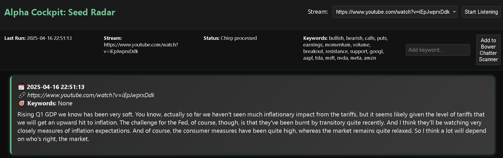
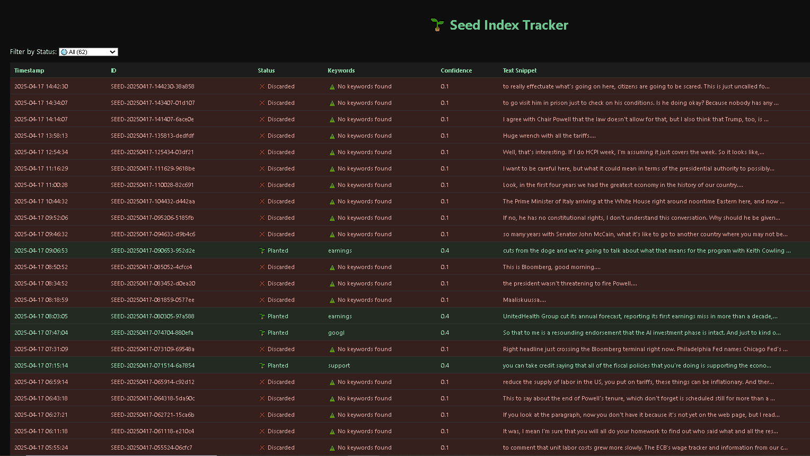

# Bowr Sentiment Sentinel  
Stream transcription powered by the OpenAI Whisper engine, with a Flask front-end to index and "germinate" leads.  

**Built with GPT-4o**

To run, you can use stream_ear_bowrv2.py directly, or app.py which is the front-end Flask app with a GUI:    

First install the dependencies with ``pip install -r requirements.txt``

Then run ``Python app.py`` for Flask app, or ``Python stream_ear_bowrv2.py`` directly. 

The Flask app runs stream_ear_bowrv2.py when the "start listening" button is clicked. Wait for chirp cards to be displayed on page.

Check terminal for app activity and progress.

*Make sure to update settings.json file with configuration variables*

You can also check endpoints like /seeds to dive deeper into the seed radar that stores and categorizes each "chirp" based on their news clustering propensity.
(More of this advanced features are under wraps for now and will be slowly released and made open source, for now this repository is a template)

